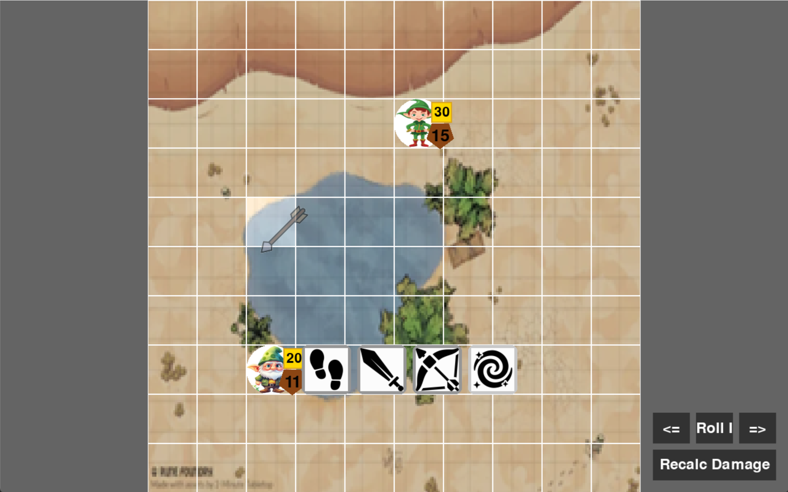

# DnD Visual Game

This repository contains a program I developed both for **self-learning** — to understand how the Pygame framework works — and as a tool to help run **DnD sessions**.

## Features
- Display of players and monsters
- Movement system
- Initiative tracking
- HP, armor, and attack range management
- Customizable maps and character setups via JSON files

## How to Run
1. Clone or download the repository.
2. Run the file `DnDVisGame.py`.
3. Provide the path to a JSON file containing:
   - Map layout
   - Player and monster data
   - Game parameters
   
Here are some screenshots of the game in action:



Example:
```bash
python DnDVisGame.py path/to/your/game_config.json


